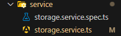
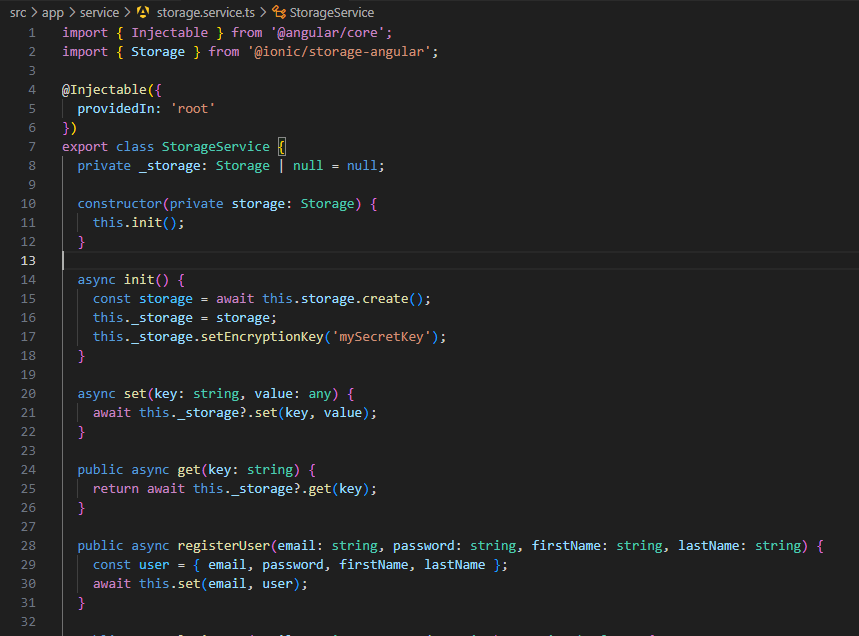
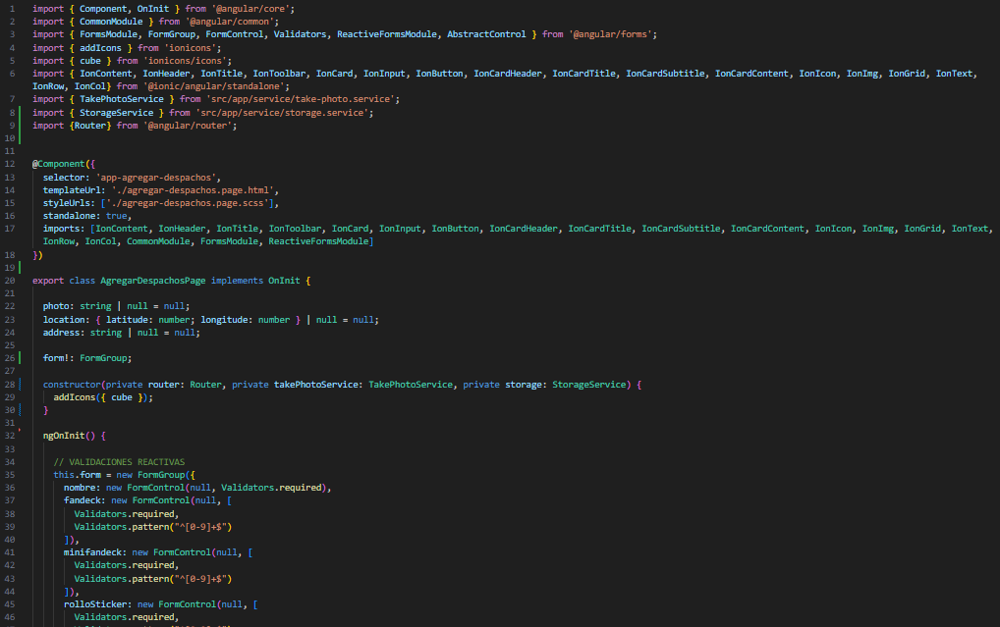
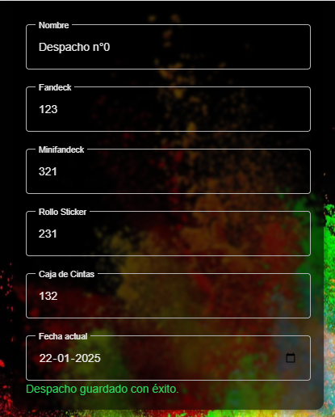
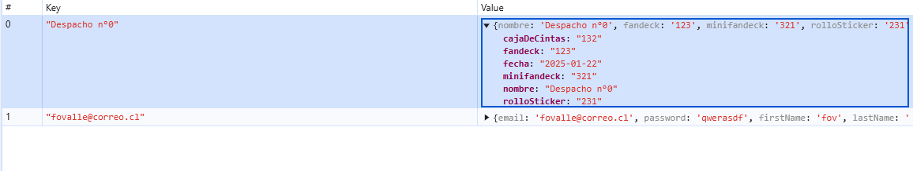

<!-- Portada -->

# Evaluación 3: Desarrollo de aplicaciones moviles
### CRUD completo
#### Profesor: Vicente Zapata
#### Autores: Matias Martínez y Fernando Ovalle

---

<!-- Segunda página con texto e imagen -->
# **Descripción proyecto**


Tercera etapa de proyecto de aplicación web donde se agrega lo siguiente: 
- CRUD despachos, tiendas y jefes 
- Lista desde API a IndexDB
--- 

# **Registro de despachos**


---

## **1. Almacenamiento en Ionic**

Primero usamos el comando ``npm install @ionic/storage`` para instalar la base de datos de Ionic ``indexDB``

--- 
##  **2. Service storage**



Creamos el servicio storage dentro de la carpeta ``service``, para agilizar el proceso podemos usar el comando ``ionic g s service/storage.service``. Después de ejecutar este comando, se crearán dos archivos:

- ``storage.service.ts``: El archivo del servicio donde puedes definir la lógica del servicio.
- ``storage.service.spec.ts``: El archivo de pruebas unitarias para el servicio.

---

## **3. Storage.service.ts**



---

### **1. clase `StorageService`**

```typescript
@Injectable({
  providedIn: 'root'
})
export class StorageService {
  private _storage: Storage | null = null;

  constructor(private storage: Storage) { 
    this.init();
  }

  async init() {
    const storage = await this.storage.create();
    this._storage = storage;
    this._storage.setEncryptionKey('mySecretKey');
  }
}
```
---
**Explicación**: 
- `StorageService` es un servicio que interactúa con la base de datos de Ionic.
- El constructor inicializa el servicio y llama al método `init` para crear una instancia de la base de datos y establecer una clave de cifrado.

---

### **2. `despachosIn`**

```typescript
public async despachosIn(
    nombre: string, 
    fandeck: number, 
    minifandeck: number, 
    rolloSticker: number, 
    cajaDeCintas: number, 
    fecha: Date) {
  try {
    const despachos = { nombre, fandeck, minifandeck, rolloSticker, cajaDeCintas, fecha};
    await this.set(nombre, despachos);
    console.log('Despacho guardado exitosamente.');
  } catch (error) {
    console.error('Error al guardar despacho:', error);
  }
}
```
---
**Explicación**: 
- `despachosIn` es un método asincrónico que registra un despacho en la base de datos de Ionic.
- Recibe los datos del despacho como parámetros y los guarda en la base de datos utilizando el método `set`.

---

### **3. `set`**

```typescript
async set(key: string, value: any) {
  await this._storage?.set(key, value);
}
```

**Explicación**: 
- `set` es un método asincrónico que guarda datos en la base de datos de Ionic.
- Recibe una clave (`key`) y un valor (`value`) como parámetros y guarda el valor en la base de datos bajo la clave especificada.

---

### **4. `get`**

```typescript
public async get(key: string) {  
  return await this._storage?.get(key);
}
```

**Explicación**: 
- `get` es un método asincrónico que obtiene datos de la base de datos de Ionic.
- Recibe una clave (`key`) como parámetro y devuelve el valor asociado a esa clave en la base de datos.

---

### **5. `init`**

```typescript
async init() {
  const storage = await this.storage.create();
  this._storage = storage;
  this._storage.setEncryptionKey('mySecretKey');
}
```

**Explicación**: 
- `init` es un método asincrónico que inicializa la base de datos de Ionic.
- Crea una instancia de la base de datos y establece una clave de cifrado para asegurar los datos almacenados.

---

## **4. Agregar-despachos.page.ts**


---

### **1. Clase `AgregarDespachosPage`**

```typescript
@Component({
  selector: 'app-agregar-despachos',
  templateUrl: './agregar-despachos.page.html',
  styleUrls: ['./agregar-despachos.page.scss'],
  standalone: true,
  imports: [IonContent, IonHeader, IonTitle, IonToolbar, IonCard, IonInput, IonButton, IonCardHeader...]
})
export class AgregarDespachosPage implements OnInit {
  // ...[Código]...
}
```

**Explicación**: 
- `AgregarDespachosPage` es un componente que representa la página para agregar despachos.
- Utiliza varios componentes de Ionic para construir la interfaz de usuario.

---

### **3. Método `guardar`**

 1/3
```typescript
async guardar() {
  if (!this.form.valid) {
    alert('Todos los campos son obligatorios.');
    return;
  }
```
---
2/3
```typescript
  const despacho = {
    nombre: this.form.value.nombre,
    fandeck: this.form.value.fandeck,
    minifandeck: this.form.value.minifandeck,
    rolloSticker: this.form.value.rolloSticker,
    cajaDeCintas: this.form.value.cajaDeCintas,
    fecha: this.form.value.fecha,
  }
  ```
---
3/3
```typescript
  await this.storage.despachosIn(this.form.value.nombre,
   this.form.value.fandeck, 
   this.form.value.minifandeck,
    this.form.value.rolloSticker, 
    this.form.value.cajaDeCintas, 
    this.form.value.fecha);
  this.router.navigate(['/agregar-despachos']);
}
```
---
**Explicación**: 
- El método `guardar` verifica si el formulario es válido.
- Si es válido, crea un objeto `despacho` con los datos del formulario y los guarda en la base de datos utilizando el método `despachosIn` del `StorageService`.
- Luego, navega de vuelta a la página de agregar despachos.

---

## **Resumen flujo de datos desde el formulario de agregar hasta la base de datos**

1. **Completar el formulario**: El usuario completa el formulario en la página `agregar-despachos.page.html`.

2. **Validación del formulario**: El método `guardar` en `agregar-despachos.page.ts` verifica si el formulario es válido.

3. **Crear objeto despacho**: Si el formulario es válido, se crea un objeto `despacho` con los datos del formulario.

4. **Guardar en la base de datos**: El método `despachosIn` del `StorageService` guarda el objeto `despacho` en la base de datos de Ionic.

5. **Navegar de vuelta**: Después de guardar, el usuario es redirigido de vuelta a la página de agregar despachos.

---

## **Resultado**



---


---

# **Guardar lista de API en indexDB**
Se utilizarán los ``tiendas.page`` para realizar este ejemplo

---

## **Configurar el servicio de almacenamiento**
1. Asegurarse de que en ``storage.service.ts`` el servicio ``StorageService`` tenga un método para guardar la lista de tiendas:

```typescript
//Registrar tienda
async setTiendas(tiendas: any[]) {
    await this.set('tiendas', tiendas);
  }
//Obtener tiendas
  async getTiendas() {
    return await this.get('tiendas');
  }
```
---

## **Configurar el servicio de tiendas**
2. Asegurarse de que el servicio ``TiendaService`` esté configurado para obtener la lista de tiendas desde la API.

```typescript
@Injectable({
  providedIn: 'root',
})
export class TiendaService {
  private apiUrl = 'https://674c886c54e1fca9290cdc56.mockapi.io/stores'; // endpoint

  constructor(private http: HttpClient) {}

  // Método para obtener las tiendas
  getTiendas(): Observable<any[]> {
    return this.http.get<any[]>(this.apiUrl).pipe(
      catchError(this.handleError)
    );
  }

  //[...]
}
```
---
## Configurar listar componente listarTiendaPage

3. Agregar:

```typescript
 ngOnInit() {
    this.loadTiendas();
  }

  async loadTiendas() {
    try {
      // Obtener la lista de tiendas desde la API
      const tiendas = await this.tiendaService.getTiendas().toPromise();
      // Guardar la lista de tiendas en la base de datos de Ionic
      if (tiendas) {
        await this.storageService.setTiendas(tiendas);
      }
      // Obtener la lista de tiendas desde la base de datos de Ionic
      this.tiendas = await this.storageService.getTiendas();
      console.log('Tiendas cargadas:', this.tiendas); // Debugging line
      this.cdr.detectChanges(); // Trigger change detection
    } catch (error) {
      console.error('Error al cargar tiendas:', error);
    }
  }
  ```
---

La función `ngOnInit` y el método `loadTiendas` en el código proporcionado están diseñados para gestionar la carga y almacenamiento de una lista de tiendas en una aplicación Angular. Aquí tienes una explicación detallada de cada parte del código:

---

### `ngOnInit`

```typescript
ngOnInit() {
  this.loadTiendas();
}
```

- `ngOnInit` es un ciclo de vida de Angular que se ejecuta después de que el componente ha sido inicializado.
- En este caso, `ngOnInit` llama al método `loadTiendas` para iniciar el proceso de carga de tiendas cuando el componente se inicializa.

---

### `loadTiendas`

```typescript
async loadTiendas() {
  try {
    // Obtener la lista de tiendas desde la API
    const tiendas = await this.tiendaService.getTiendas().toPromise();
    // Guardar la lista de tiendas en la base de datos de Ionic
    if (tiendas) {
      await this.storageService.setTiendas(tiendas);
    }
    // Obtener la lista de tiendas desde la base de datos de Ionic
    this.tiendas = await this.storageService.getTiendas();
    console.log('Tiendas cargadas:', this.tiendas); // Debugging line
    this.cdr.detectChanges(); // Trigger change detection
  } catch (error) {
    console.error('Error al cargar tiendas:', error);
  }
}
```

---

- `loadTiendas` es un método asíncrono que realiza varias tareas para gestionar la lista de tiendas.
- **Obtener tiendas desde la API**: Utiliza `tiendaService.getTiendas().toPromise();` para obtener la lista de tiendas desde una API. 
- **Guardar tiendas en la base de datos de Ionic**: Si la lista de tiendas se obtiene correctamente, se guarda en la base de datos local utilizando `storageService.setTiendas(tiendas)`.
- **Obtener tiendas desde la base de datos de Ionic**: Luego, se recupera la lista de tiendas desde la base de datos local y se asigna a `this.tiendas`.
- **Depuración**: Se imprime la lista de tiendas en la consola para fines de depuración.
---

- **Detección de cambios**: Se llama a `this.cdr.detectChanges()` para forzar la detección de cambios en el componente, asegurando que la vista se actualice con la nueva lista de tiendas.
- **Manejo de errores**: Si ocurre algún error durante el proceso, se captura y se imprime en la consola.

Este código asegura que la lista de tiendas se cargue desde una API remota, se almacene localmente y se recupere para su uso en la aplicación.


