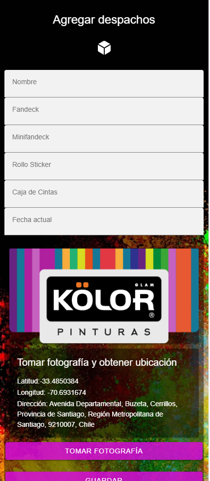
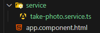
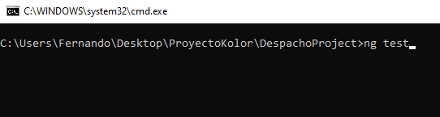
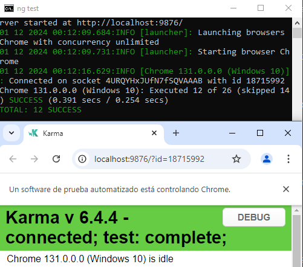
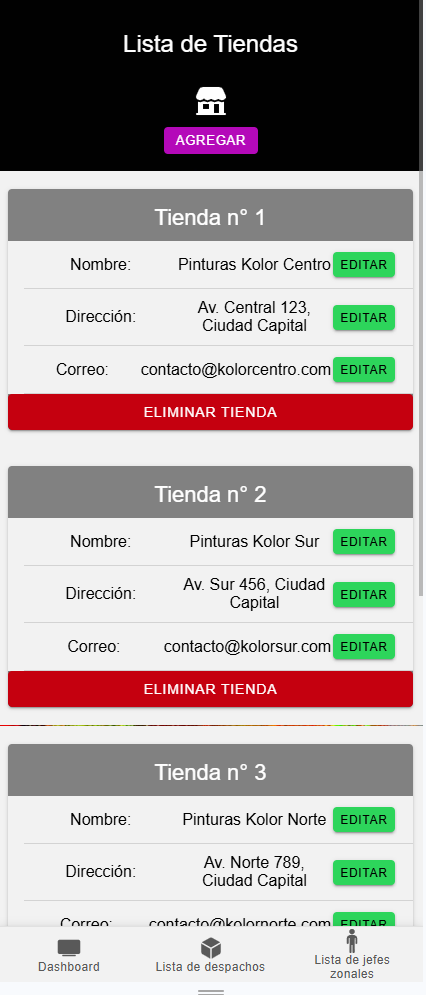
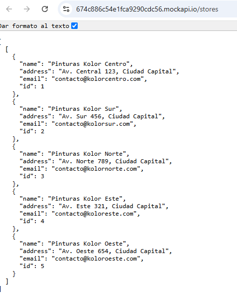
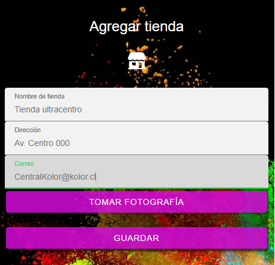
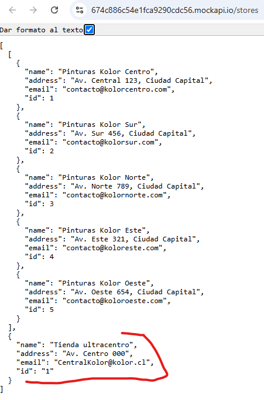

<!-- Portada -->
# **Evaluación 2**
### Curso: *Desarrollo de aplicaciones móviles*

 
**Profesor:** Vicente Zapata  
**Alumnos:** Matías Martinez, Fernando Ovalle

---

<!-- Descripción -->
# **Descripción del Proyecto**

Continuación de construcción de aplicación movil utilizando Ionic y Angular. En esta etapa se agrega lo siguiente:

- Función de capturar imagenes en sección de agregar Despacho, Tienda y Jefe zonal 
- Integración de GPS 
- Pruebas automatizadas para verificar funcionalidad de captura y GPS 
- Importación de información desde una API externa 
- Sincronización con un servicio web o API externa para almacenar de forma remota


---

# **Integración GPS y capturar fotos** 
En los ``agregar.page`` se pone la función de captura de fotografías y ubicación para agregar junto al despacho, jefe zona y tienda.



---
## **1. Creación service take-photo.service.ts en carpeta service**
Servicio para capturar una foto desde la cámara o cargar desde galería, obtener la ubicación actual (coordenadas) y convertirla en una dirección.


---
### Imports
```typescript
import { Injectable } from '@angular/core';
import { Camera, CameraResultType, CameraSource } from '@capacitor/camera';
import { Geolocation } from '@capacitor/geolocation';
import { Platform } from '@ionic/angular';
```
- ``Camera``: Para capturar fotos.
- ``Geolocation``: Para obtener coordenadas GPS.
- ``Platform``: Identifica la plataforma del dispositivo.

---
## Declaración del servicio

```typescript
@Injectable({
    providedIn: 'root',
})
export class TakePhotoService {
    photo: string | null = null;
    location: { latitude: number; longitude: number } | null = null;
    address: string | null = null;

    constructor(private platform: Platform) {}
}
```
- ``@Injectable``: Hace que este servicio sea inyectable.
- Propiedades inicializadas para almacenar datos: foto, coordenadas y dirección.
- Constructor con ``Platform`` para manejar fuentes de cámara según el dispositivo.

---
## Método principal: Capturar Foto y Ubicación
```typescript
async takePhoto() {
    const cameraSource = this.platform.is('android') ? CameraSource.Photos : CameraSource.Camera;

    // Capturar foto
    const image = await Camera.getPhoto({
        quality: 90,
        resultType: CameraResultType.Uri,
        source: cameraSource,
    });
    this.photo = image.webPath || null;

    // Obtener ubicación
    const coordinates = await Geolocation.getCurrentPosition();
    this.location = {
        latitude: coordinates.coords.latitude,
        longitude: coordinates.coords.longitude,
    };

    // Obtener dirección
    this.address = await this.getAddressFromCoordinate(this.location.latitude, this.location.longitude);

    return {
        photo: this.photo,
        location: this.location,
        address: this.address,
    };
}

```
---
- ``cameraSource``: Cambia entre galería o cámara según la plataforma.
- ``const image``: Usa ``Camera.getPhoto()`` con quality y URI.
- ``const coordinates``: Usa ``Geolocation`` para obtener latitud y longitud.
- ``this.address``: Llama al método ``getAddressFromCoordinate``.
---
## Método auxiliar: Convertir Coordenadas en Dirección

```typescript
async getAddressFromCoordinate(latitude: number, longitude: number): Promise<string | null> {
    const url = `https://nominatim.openstreetmap.org/reverse?lat=${latitude}&lon=${longitude}&format=json`;
    try {
        const response = await fetch(url);
        const data = await response.json();
        return data.display_name || 'Dirección no disponible';
    } catch (error) {
        console.error('Error al obtener la dirección:', error);
        return null;
    }
}
```
- ``const url``: Llama a la API de OpenStreetMap para convertir coordenadas.
- Manejo de errores ``try {}``: Devuelve ``null`` si ocurre un problema.

---

## **2. Interfaz gráfica en ``agregar-despachos.page.html``:**
### Mostrar foto

```html
<ion-card *ngIf="photo">
  <ion-img [src]="photo"></ion-img>
</ion-card>
```
- ``<ion-card>``: Contenedor para mostrar la foto.
- ``*ngIf="photo"``: Muestra la tarjeta solo si existe una foto (photo no es ``null``).
- ``<ion-img>``: Componente de Ionic para mostrar la imagen capturada desde su ``URL``.

---
### Mostrar ubicación y dirección
```html
<ion-card *ngIf="location">
  <ion-card-header>
    <ion-card-title>Tomar fotografía y obtener ubicación</ion-card-title>
  </ion-card-header>
  <ion-card-content>
    <p>Latitud: {{location.latitude}}</p>
    <p>Longitud: {{location.longitude}}</p>
    <p>Dirección: {{address}}</p>
  </ion-card-content>
</ion-card>
```
---
### Botón capturar datos
```html
<ion-button expand="block" (click)="capturePhoto()">Tomar fotografía</ion-button>
```
- ``expand="block"``: Botón ocupa todo el ancho disponible.
- ``(click)="capturePhoto()"``: Vincula el botón al método ``capturePhoto()`` para capturar foto y ubicación.
- 
---
### 3. Lógica en ``agregar-despachos.page.ts``
Agregando propiedades de componente.
```typescript
export class AgregarDespachosPage implements OnInit {

  photo: string | null = null;
  location: { latitude: number; longitude: number } | null = null;
  address: string | null = null;
```
---

Función asincrona, saca la foto y después almacena foto y ubicación.
```typescript
 async capturePhoto() {
    const result = await this.takePhotoService.takePhoto()
    if(result){
      this.photo = result.photo;
      this.location = result.location;
      this.address = result.address;
    }
  }
```


---

<!-- PRUEBAS-->
# **Código para pruebas automatizadas de funciones para capturar fotos y GPS**
En los archivos `spec.ts` de cada pagina para *agregar* colocamos *pruebas* para probar la cámara y el GPS. Son 4 pruebas por cada ``agregar.page``, 12 entre las 3 entidades

---

## **Ejemplo en agregar-despachos.page.spec.ts:**
### Imports

```typescript
import { ComponentFixture, TestBed } from '@angular/core/testing';
import { AgregarDespachosPage } from './agregar-despachos.page';
import { TakePhotoService } from 'src/app/service/take-photo.service'; // Servicio de fotos
import { FormsModule } from '@angular/forms'; // Para formularios
import { IonContent, IonHeader, IonCard, IonInput, IonButton } from '@ionic/angular/standalone';
```
---

### Mock del servicio de TakePhotoService

Simulación del servicio de captura y GPS 

``` typescript
const mockTakePhotoService = {
  takePhoto: jasmine.createSpy('takePhoto').and.returnValue(Promise.resolve({
    photo: 'mock-photo-data',
    location: { latitude: 12.34, longitude: 56.78 },
    address: 'Mock Address'
  }))
};
```
---

### Configuración de entorno de pruebas

Simulación del servicio de captura y GPS 

``` typescript
  beforeEach(async () => {
    await TestBed.configureTestingModule({
      imports: [FormsModule, IonContent, IonHeader, IonCard, IonInput, IonButton, AgregarDespachosPage],
      providers: [
        { provide: TakePhotoService, useValue: mockTakePhotoService } // Usamos el mock
      ]
    }).compileComponents();

    const fixture = TestBed.createComponent(AgregarDespachosPage);
    component = fixture.componentInstance; // Creamos el componente
  });
```
---

## **Pruebas**

### Creación del componente

``` typescript
fit('debería crear el componente', () => {
  expect(component).toBeTruthy();
});
```

---

### Capturar foto y obtener ubicación con GPS
Se usan datos de prueba.
``` typescript
fit('debería capturar una foto y obtener ubicación', async () => {
  await component.capturePhoto(); // Llama al método
  expect(component.photo).toBe('mock-photo-data'); // Verifica que se guarde la foto
  expect(component.location).toEqual({ latitude: 12.34, longitude: 56.78 }); // Verifica la ubicación
  expect(component.address).toBe('Calle muy falsa 321'); // Verifica la dirección
});

```
--- 

### Validación de Campos al Guardar

``` typescript
fit('debería mostrar un error si faltan campos al guardar', () => {
  spyOn(window, 'alert'); // Simula la alerta
  component.guardar(); // Llama al método guardar()
  expect(window.alert).toHaveBeenCalledWith('Todos los campos son obligatorios.'); // Verifica el mensaje
});

```
---

### Guardado exitoso

``` typescript

fit('debería mostrar éxito al guardar con todos los campos', () => {
  spyOn(window, 'alert'); // Simula la alerta
  component.nombre = 'Prueba';
  component.fandeck = 1;
  component.minifandeck = 1;
  component.rolloSticker = 1;
  component.cajaDeCintas = 1;
  component.fecha = new Date();
  component.guardar();
  expect(window.alert).toHaveBeenCalledWith('Despacho guardado exitosamente.');
});

```
---

## **Imágenes test de funciones**
 Comando ``ng test`` en carpeta del proyecto, 12 tests exitosos





---

# **Importación de información desde una API externa** 


---

## **``tienda.service.ts``**


Servicio en Angular que interactúa con la API de tiendas para obtener datos
### Imports y configuración
```typescript
import { Injectable } from '@angular/core';
import { HttpClient } from '@angular/common/http';
import { Observable } from 'rxjs';

@Injectable({
  providedIn: 'root',
})
export class TiendaService {
  private apiUrl = 'https://674c886c54e1fca9290cdc56.mockapi.io/stores'; // endpoint
  constructor(private http: HttpClient) {}
}
```
---

- ``@Injectable``: Define que este servicio puede ser inyectado en cualquier parte de la aplicación.
- ``apiUrl``: Almacena la URL base del endpoint.
- ``HttpClient``: Servicio para realizar solicitudes HTTP.

---
## Método: Obtener todas las tiendas

```typescript
getTiendas(): Observable<any[]> {
  return this.http.get<any[]>(this.apiUrl);
}
```

- `Objetivo`: Realiza una solicitud GET al endpoint para obtener un arreglo con todas las tiendas.
- Tipo de Retorno: ``Observable<any[]>`` para manejar datos de forma reactiva.

---
## **``listar-tiendas.page.ts``**
Listar las tiendas obtenidas desde una API externa

### Imports
```typescript
import { Component, OnInit } from '@angular/core';
import { TiendaService } from '../../../service/tienda.service';
import { Router } from '@angular/router';
```
- ``TiendaService``: Servicio para interactuar con la API de tiendas.
- ``Router``: Navegación entre páginas dentro de la aplicación

---
### Declaración de la interfaz
```typescript
export interface Tienda {
  id: number,
  name: String,
  address: String, 
  email: String,
  create_at: Date
}
```
- Definición de la estructura de datos para una tienda

---
### Configuración de componente
```typescript
@Component({
  selector: 'app-listar-tiendas',
  templateUrl: './listar-tiendas.page.html',
  styleUrls: ['./listar-tiendas.page.scss'],
  standalone: true,
  imports: [...],
})
export class ListarTiendasPage implements OnInit {
  tiendas: any[] = [];
  constructor(private tiendaService: TiendaService) {}
}
```
- ``standalone``: Define que este componente es independiente.
- ``tiendas``: Variable que almacena la lista de tiendas obtenida desde la API.

---

### Consumo de la API en ``ngOnInit``

```typescript
ngOnInit() {
  this.tiendaService.getTiendas().subscribe(
    (data) => {
      this.tiendas = data[0];
      console.log('Tiendas en variable:', this.tiendas);
    },
    (error) => {
      console.error('Error al cargar tiendas:', error);
    }
  );
}
```
- ``ngOnInit``: Se ejecuta al inicializar el componente.
- ``this.tiendaService.getTiendas()``: Llama al servicio para obtener la lista de tiendas.
- Manejo de Respuesta:
  - ``data``: Almacena la respuesta exitosa.
  - ``error``: Muestra un error si la solicitud falla.

---
### Imagenes de los resultados




---

# **Sincronización con un servicio web o API externa para almacenar de forma remota**


---
## **``tienda.service.ts``**
### Método: Agregar Tienda

```typescript
agregarTienda(tienda: any): Observable<any> {
  return this.http.post<any>(this.apiUrl, tienda);
}
```
- ``agregarTienda``: Este método usa una solicitud HTTP POST para enviar los datos de una tienda a la API y crearla en el servidor.
- Parámetro: ``tienda`` (tipo ``any``), que representa los datos de la tienda a ser almacenados.
- Tipo de Retorno: ``Observable<any>``, lo que permite manejar la respuesta de la API de manera reactiva.
---

### Endpoint de la API

```typescript
private apiUrl = 'https://674c886c54e1fca9290cdc56.mockapi.io/stores'; // endpoint
```

- guardamos en el endpoint de Mockapi con el que alimentamos la lista 

---
## **``agregar-tienda.page.html``**

### Estructura del Formulario

```html
<form (ngSubmit)="agregarTienda()">
  <ion-input [(ngModel)]="newTienda.name" name="name" label="Nombre de tienda" label-placement="floating" fill="solid" placeholder="Nombre de tienda"></ion-input>
  <ion-input [(ngModel)]="newTienda.address" name="address" label="Dirección" label-placement="floating" fill="solid" placeholder="Dirección de la tienda"></ion-input>
  <ion-input [(ngModel)]="newTienda.email" name="email" label="Correo" label-placement="floating" fill="solid" type="email" placeholder="Correo electrónico"></ion-input>
</form>
```

- ``ngSubmit``: Ejecuta el método ``agregarTienda()`` cuando se envía el formulario.
- ``ngModel``: Vincula los campos del formulario a las propiedades de ``newTienda``, que contiene los datos a enviar.
- Campos: Nombre, dirección y correo de la tienda.

---
### Botón formulario 

```typescript
<ion-button (click)="agregarTienda()" expand="block">Guardar</ion-button>
```
- Botón "Guardar": Llama al método ``agregarTienda()`` para guardar los datos en la API.

---

## **``agregar-tienda.page.html``**
### Variable para Almacenar Datos del Formulario

```typescript
newTienda = {
  name: '',
  address: '',
  email: ''
};
```
- ``newTienda``: Es un objeto que contiene las propiedades name, address y email. Estos campos se llenan a medida que el usuario introduce la información en el formulario y se envían cuando el formulario es enviado.
---

### Método agregar tienda a API
```typescript
agregarTienda() {
  if (this.newTienda.name && this.newTienda.address && this.newTienda.email) {
    this.tiendaService.agregarTienda(this.newTienda).subscribe(
      (data) => {
        console.log('Tienda agregada:', data);
        this.newTienda = { name: '', address: '', email: '' };  // Limpiar el formulario
      },
      (error) => {
        console.error('Error al agregar tienda:', error);
      }
    );
  }
}
```
- Método ``agregarTienda()``: Llama al servicio ``tiendaService`` para agregar la tienda al endpoint de la API, usando ``POST`` para enviar los datos.

---


 


